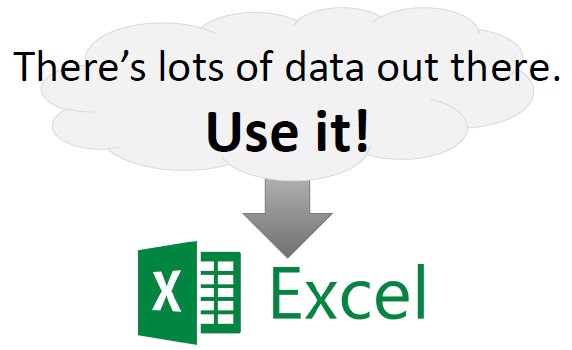

# January 2018 - Data Sources in Microsoft Excel 2016

The purpose of this workshop is to demonstrate linking together resources from multiple locations,
and show off Excel's [3D Maps feature](https://support.office.com/en-us/article/Get-started-with-3D-Maps-6b56a50d-3c3e-4a9e-a527-eea62a387030),
which now comes standard in Microsoft Excel 2016.

It may be possible to run this workshop using Microsoft Excel 2013 with the following addins,
although this has not been tested.
- [Power Query](https://www.microsoft.com/en-ca/download/details.aspx?id=39379)
- [Power Map](http://www.microsoft.com/en-in/download/details.aspx?id=38395)

This workshop will run from Tuesday, January 9th, 2018 to Friday, January 12th, 2018.

**External data sources may not remain available or compatible after the workshop is complete.**

## Workshop Resources

**Participants**
- [Workshop Landing Page](https://cityssm.github.io/itWorkshops/2018-01-excel/index.htm)

**Presenter**
- [Presentation](presentation.pptx)
- [Speaking Notes](speakingNotes.md)
