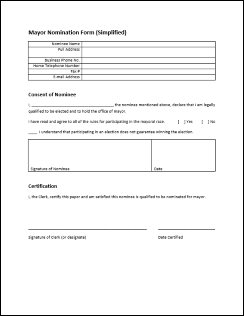

# Mock Election Workshop - Agenda

Note that there are oftentimes multiple ways to solve problems,
and there may be more solutions than the ones offered.

Maybe you already have a solution to the problem.
Maybe my solution is better.  Maybe your solution is better.
If you pick up at least one new tip from this workshop, I believe it's been an success.

## Step One - We're having an election!

### Call for Candidates Poster - Microsoft Publisher

Start with [Call for Candidates poster](demoDocuments/callForCandidates.pub) in Microsoft Publisher.

#### A scripting font is used for the heading.

- Generally these fonts are difficult to read, and their use should be limited.

:heavy_check_mark:
Replace the font with something less decorative.

#### The heading has a background image that makes the text difficult to read.

Demo Protanopia and Deuteranopia using [CBSim.jar](http://lpetrich.org/Science/ColorBlindnessSim/ColorBlindnessSim.html#use_app).

> Success Criterion 1.4.3 Contrast (Minimum)
> (Level AA)
>
> The visual presentation of text and images of text has a contrast ratio of at least 4.5:1, except for the following:
>
> - Large Text - Large-scale text and images of large-scale text have a contrast ratio of at least 3:1;
> - ...

:heavy_check_mark:
Change the colours, or shift the background image down.

#### The website address is "impossible" to remember.

:heavy_check_mark:
Use a shortened website address.

#### Location name and map and included, but simple address information is missing.

:heavy_check_mark:
Add an easy-to-read address.

---

### Candidate Nomination Form - Microsoft Word

Start with [Nomination Form](demoDocuments/nominationForm.docx) in Microsoft Word.

#### Insufficient space to fill out the form.

:heavy_check_mark:
Add some line spaces around the fields.

#### Inconsistent abbreviation of the word "number".

> Success Criterion 3.1.4 Abbreviations
> (Level AAA)
>
>A mechanism for identifying the expanded form or meaning of abbreviations is available.

:heavy_check_mark:
Avoid abbreviations if possible.  Expand "No." and "#" to "Number".

#### Include inconsistent field styles.

> Success Criterion 3.2.4 Consistent Identification§
> (Level AA)
>
> Components that have the same functionality within a set of Web pages are identified consistently.

:heavy_check_mark:
Ensure consistency.

---

## Step Two - The candidates are ready

### All Candidate Letter - Microsoft Word

Start with [All Candidate Letter](demoDocuments/allCandidateLetter.docx) in Microsoft Word.

#### A scripting font is used for the body of the letter.

:heavy_check_mark:
Replace it with a more appropriate font.

#### Document uses full justification.

Full justification is an accessibility concern.

> Success Criterion 1.4.8 Visual Presentation
> (Level AAA)
>
> For the visual presentation of blocks of text, a mechanism is available to achieve the following:
> - ...
> - Text is not justified (aligned to both the left and the right margins).
> - ...

:heavy_check_mark:
Left justify the text.

#### Language is unnecessarily complicated.

Check the reading level of the document.

- Under the *File* tab, select *Options*.
- Under *Proofing*, make sure *Show readability statistics* is checked.
- Return to the document.
- Click the *Proofing Errors* button in the bottom-left corner.

> Success Criterion 3.1.5 Reading Level
> (Level AAA)
>
> When text requires reading ability more advanced than the lower secondary education level
> after removal of proper names and titles, supplemental content, or a version
> that does not require reading ability more advanced than the lower secondary education level, is available.

:heavy_check_mark:
Reduce the unnecessary complexity.

#### Header is the hero.

- It should not be larger than the content.

:heavy_check_mark:
Reduce the font size of the header.

#### Mail merge the candidate information.

- Make sure [Candidates.csv](candidates/candidates.csv) is downloaded.
- Under the *Mailings* tab, choose *Select Recipients*, then *Use an Existing List*.
- Replace "Mayoral Candidate" with the *CandidateName* merge field.

---

## Step Three - Cast your votes

Have each workstation act as a polling station, submitting up to 110 votes.
Gather those votes into a CSV file.

---

## Step Four - The votes are in!

### Tally the Votes - Microsoft Excel

[Sub Agenda - Tally the Votes](SUBAGENDA-tallyTheVote.md)

Import CSV results into Excel.

- Use pivot tables and charts to summarize and determine winner.
- Use pivot tables and charts to forecast possible "media scandals".
- Change the results of one of the polling stations, forcing a refresh.  i.e. a recount.

---

## Step Five - And the winner is...
